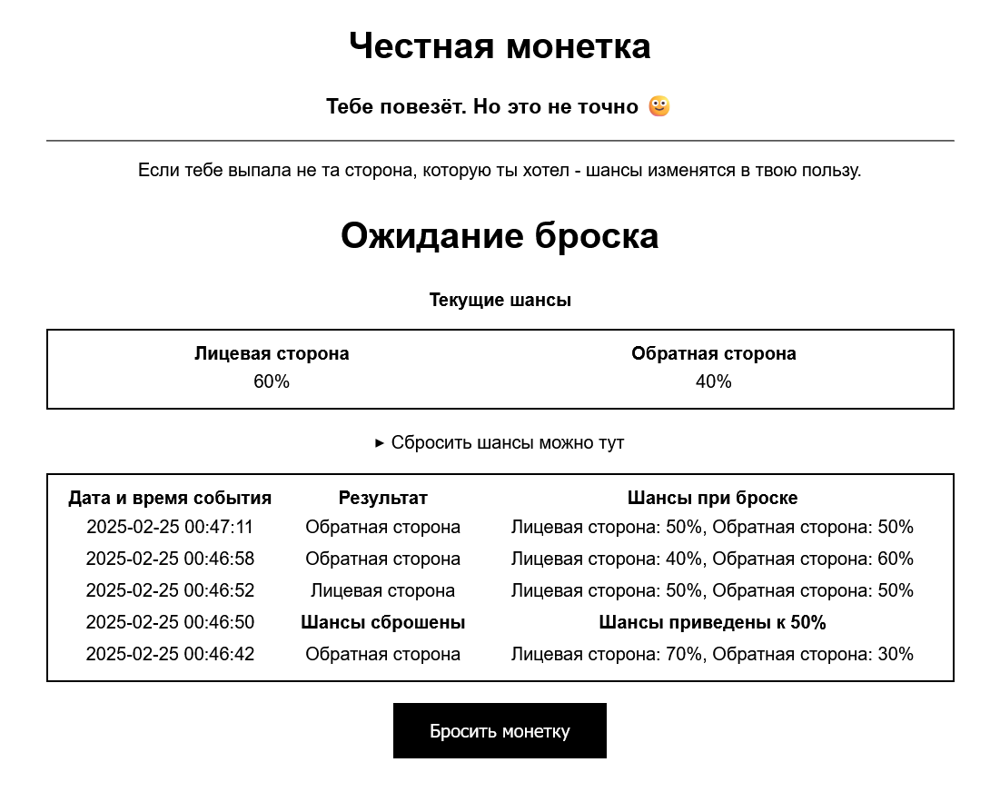
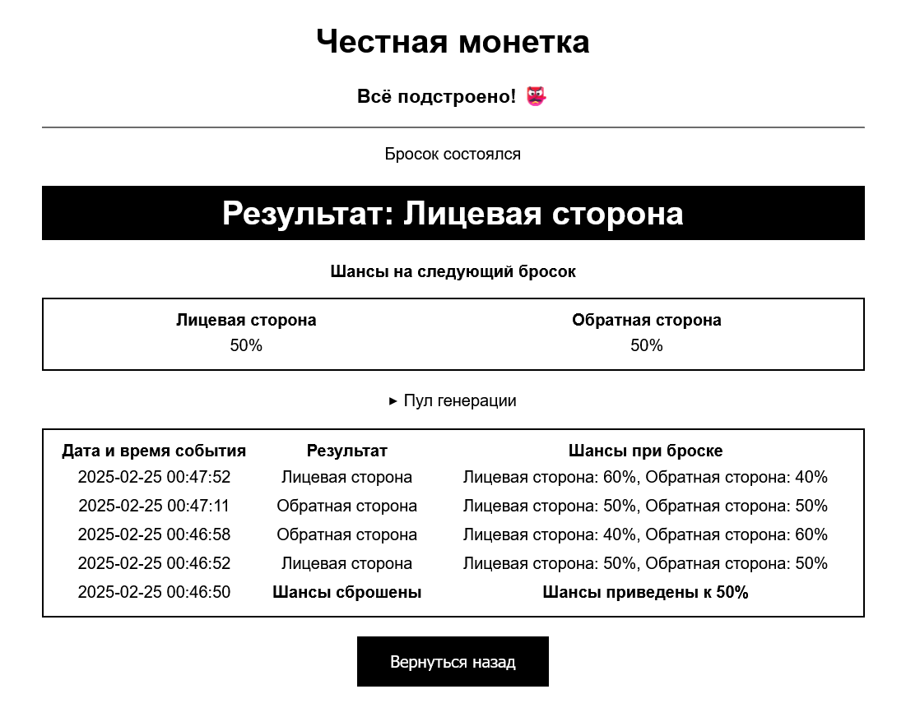

# Честная монетка
> "Мы говорим случаю - не сегодня"


_Страница броска монетки_


_Страница результата_


## Что здесь происходит?

Мы с женой часто решаем, кто будет делать нечто, что делать не хочет никто. Один из вариантов договориться — бросить монетку.\
Однако обычная, полностью случайная монетка иногда начинает играть против кого-то одного. По крайней мере, так может показаться.

Для того чтобы немного унять неуёмный рандом (и дать больше надежды своему оппоненту), я написал приложение, которое помогает проигравшему выиграть в следующий раз, но при этом не исключает случай полностью.

### Базовые правила

1. Играют только двое. 
2. Каждый игрок должен выбрать себе постоянную сторону монетки.
3. Изначально шансы выпадения сторон равны, но при выпадении определённой стороны монетки шансы на её повторное выпадение понижаются на 10%. 
4. Шансы (как и история бросков) сохраняются, поэтому следующий бросок будет произведён с обновлёнными шансами. 
5. Минимальный шанс выпадения определённой стороны - 10%, максимальный - 90%.
6. Шансы можно сбросить к изначальным. Сброс записывается в историю. Не жульничайте!

### Ограничения

1. Из-за особенностей реализации монетка может быть брошена при переходе на страницу результата из истории, учитывайте это.
2. Сбросить историю нельзя, но можно задать длину её отображения и хранения. 
3. Приложение никак не авторизует пользователя. Для ограничения доступа к приложению придётся воспользоваться сторонними средствами.

## Как это установить?

Приложение упаковано в контейнер и доступно для установки через Docker. 

### Переменные окружения

| Переменная           | Формат / Значение по умолчанию | Назначение                                                                                            |
|----------------------|--------------------------------|-------------------------------------------------------------------------------------------------------|
| `TZ`                 | `Etc/GMT-5`                    | Часовой пояс для записи времени в истории бросков                                                     |
| `URL`                | `http://127.0.0.1:8080`        | Базовый URL, по которому доступно приложение.<br><b>Не забудьте переопределить его перед запуском.<b> |
| `CUSTOM_HEAD_LABEL`  | `Лицевая сторона`              | Пользовательское название лицевой стороны монетки                                                     |
| `CUSTOM_TAIL_LABEL`  | `Обратная сторона`             | Пользовательское название обратной стороны монетки                                                    |
| `SHRINK_HISTORY_TO`  | `5`                            | Длина отображаемой и хранимой истории бросков                                                         |

### Docker Compose

#### Готовый контейнер
```yml
services:
  faircoin:
    image: ghcr.io/podbolotov/faircoin:latest
    ports:
      - 8080:8080
    environment:
      - TZ=Etc/GMT-5
      - URL=http://127.0.0.1:8080
      - CUSTOM_HEAD_LABEL=Лицевая сторона
      - CUSTOM_TAIL_LABEL=Обратная сторона
      - SHRINK_HISTORY_TO=5
    volumes:
      - ./storage:/app/storage
```

#### Сборка напрямую с GitHub
```yml
services:
  faircoin:
    build: https://github.com/podbolotov/Fair-Coin.git#main
    image: faircoin:1.1.0
    ports:
      - 8080:8080
    environment:
      - TZ=Etc/GMT-5
      - URL=http://127.0.0.1:8080
      - CUSTOM_HEAD_LABEL=Лицевая сторона
      - CUSTOM_TAIL_LABEL=Обратная сторона
      - SHRINK_HISTORY_TO=5
    volumes:
      - ./storage:/app/storage
```

### Развёртывание за обратным прокси

Ввиду того, что результаты броска передаются на результирующую страницу как query-параметры, необходимо убедиться в том, что ваш обратный прокси позволяет передавать большие заголовки запроса. 

Ниже приведены названия и минимально допустимые значения параметров, которые необходимо установить для корректной работы сервиса в случае, если в качестве обратного прокси используется NGINX.

```
# FairCoin server block
server {
    ...
    fastcgi_buffers 16 32k;
    fastcgi_buffer_size 32k;
    proxy_buffer_size 128k;
    proxy_buffers 4 256k;
    proxy_busy_buffers_size 256k;
    ...
    location / {
        ...
        proxy_pass http://127.0.0.1:8080;
        ...
	}
}
```

## Лицензия

- Приложение предоставляется под [The MIT License (MIT)](./LICENSE)
- Настоящее приложение использует [FastAPI](https://github.com/fastapi/fastapi)

## Посвящение
- Идейный вдохновитель: [developer-kaczmarek](https://github.com/developer-kaczmarek)
