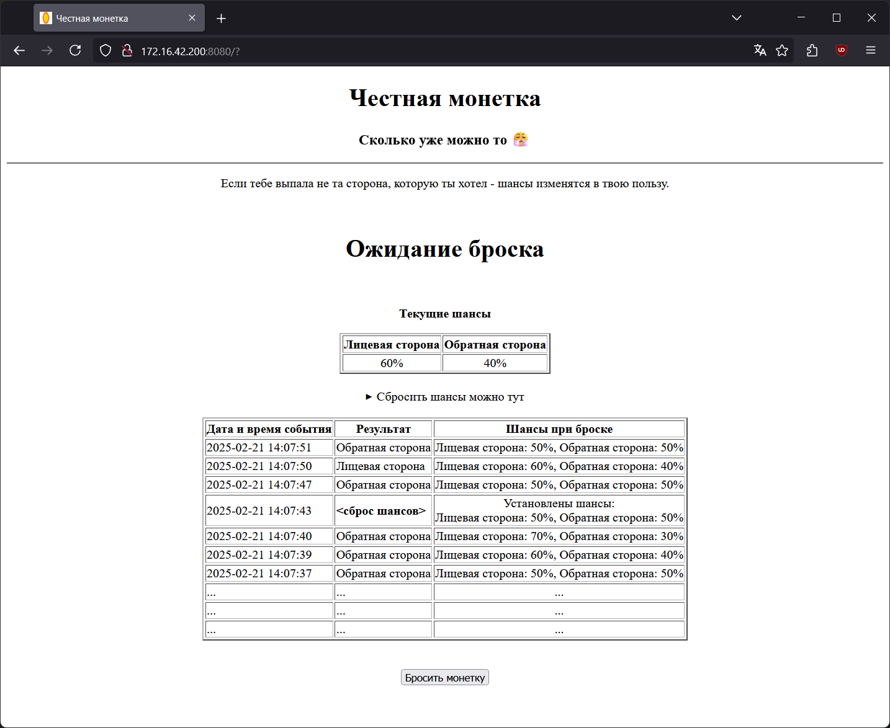
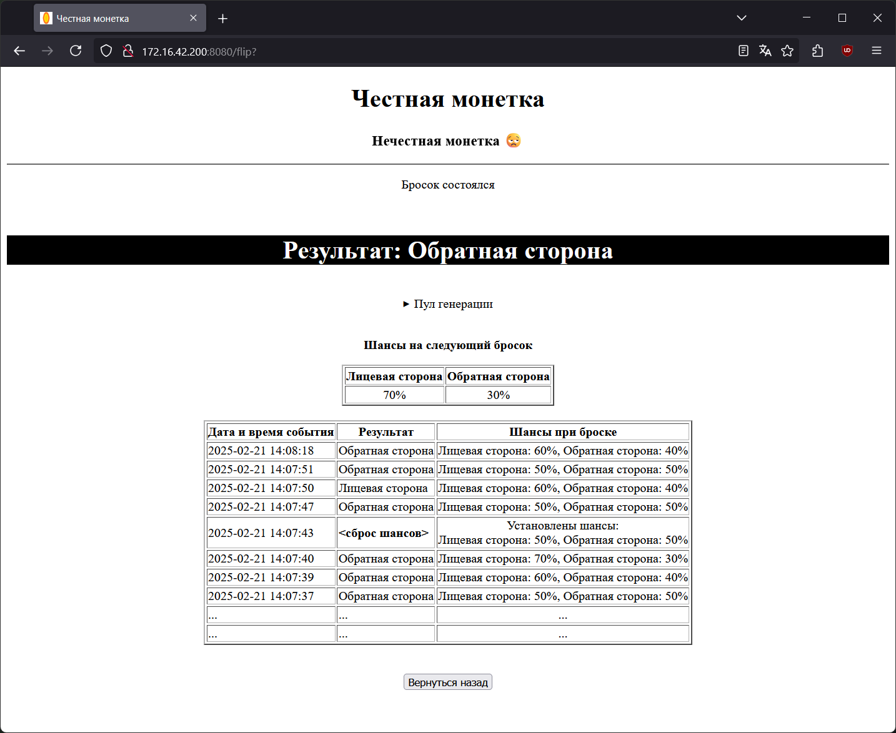

# Честная монетка
> "Мы говорим случаю - не сегодня"

<center>
<i>Страница броска монетки</i>
<br/><br/>

<i>Страница результата</i>

</center>

## Что здесь происходит?

Мы с женой часто решаем, кто будет делать нечто, что делать не хочет никто. Один из вариантов решить - бросить монетку.\
Однако обычная, полностью случайная монетка иногда начинает играть против кого-то одного. 

Для того чтобы уравновесить разбушевавшийся рандом - я написал приложение, которое помогает проигравшему выиграть в следующий раз, но при этом не исключает случай полностью.

### Базовые правила

1. Играют только двое. 
2. Каждый игрок должен выбрать себе постоянную сторону монетки.
3. Изначально шансы выпадения сторон равны, но при выпадении определённой стороны монетки шансы на её повторное выпадение понижаются на 10%. 
4. Шансы (как и история бросков) сохраняются, поэтому следующий бросок будет произведён с обновлёнными шансами. 
5. Минимальный шанс выпадения определённой стороны - 10%, максимальный - 90%.
6. Шансы можно сбросить к изначальным. Сброс записывается в историю. Не жульничайте!

### Ограничения

1. Страницы приложения рендерятся на сервере, вследствие чего монетка может быть брошена не только нажатием на кнопку "Бросить монетку", но и обновлением страницы результата. 
2. Также монетка будет брошена при переходе на страницу результата из истории, учитывайте это.
3. Сбросить историю нельзя, но можно задать длину её отображения и хранения. 

## Как это установить?

Приложение упаковано в контейнер и доступно для установки через Docker. 

### Переменные окружения

| Переменная           | Формат / Значение по умолчанию | Назначение                                         |
|----------------------|--------------------------------|----------------------------------------------------|
| `URL`                | `http://127.0.0.1:8080`        | Базовый URL, по которому доступно приложение       |
| `CUSTOM_HEAD_LABEL`  | `Лицевая сторона`              | Пользовательское название лицевой стороны монетки  |
| `CUSTOM_TAIL_LABEL`  | `Обратная сторона`             | Пользовательское название обратной стороны монетки |
| `SHRINK_HISTORY_TO`  | `10`                           | Длина отображаемой и хранимой истории бросков      |

### Docker Compose

#### Готовый контейнер
```yml
<ожидается подготовка и публикация готового контейнера>
```

#### Сборка напрямую с GitHub
```yml
services:
  faircoin:
    build: https://github.com/podbolotov/Fair-Coin.git#main
    image: faircoin:1.0.0
    ports:
      - 8080:8080
    environment:
      - URL=http://127.0.0.1:8080
      - CUSTOM_HEAD_LABEL=Лицевая сторона
      - CUSTOM_TAIL_LABEL=Обратная сторона
      - SHRINK_HISTORY_TO=10
    volumes:
      - ./storage:/app/storage
```

## Лицензия

- Приложение предоставляется под [The MIT License (MIT)](./LICENSE)
- Настоящее приложение использует [FastAPI](https://github.com/fastapi/fastapi)
